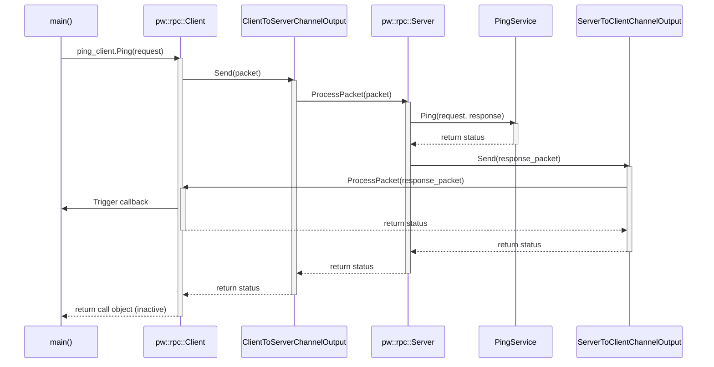

# pw_rpc Minimal Demo

This project demonstrates a minimal setup of Pigweed's `pw_rpc` using `nanopb` for code generation in a vanilla CMake project, without requiring the full Pigweed bootstrap.

## Prerequisites

Before building, you must install the required dependencies.
On Debian-based systems, you can use the provided script:

```bash
./prereqs.sh
```

For other systems, ensure you have:
*   C/C++ compiler (e.g. GCC, Clang)
*   CMake (>= 3.20)
*   Ninja (or Make)
*   Protobuf compiler (`protoc`)
*   Python 3 with `protobuf` and `pyserial` libraries.

## Build and Run

1.  **Build**:
    ```bash
    ./build.sh
    ```
2.  **Run**:
    ```bash
    ./build/rpc_demo
    ```

## Architecture

This demo runs entirely in a single thread, using a synchronous loopback channel to connect the `pw_rpc` Client and Server.

### Loopback Communication

We implement two custom `pw::rpc::ChannelOutput` classes:
*   `ClientToServerChannelOutput`: Intercepts packets sent by the client and forwards them directly to the server by calling `server.ProcessPacket()`.
*   `ServerToClientChannelOutput`: Intercepts packets sent by the server (responses) and forwards them directly to the client by calling `client.ProcessPacket()`.

Because these call each other directly, the entire RPC transaction (request -> service execution -> response -> client callback) happens synchronously within the call stack of `ping_client.Ping()`.



### Threading and Locking

By default, `pw_rpc` uses a global mutex to ensure thread safety. In a synchronous loopback setup on a single thread, this would lead to a deadlock:
1.  Client locks the global mutex when starting the call.
2.  Client calls `Send`, which calls `Server::ProcessPacket`.
3.  Server tries to lock the same global mutex, causing a deadlock.

To resolve this, we configure Pigweed with `PW_RPC_USE_GLOBAL_MUTEX=0` in `CMakeLists.txt`. This replaces the global mutex with a dummy lock, which is safe since the demo is strictly single-threaded.

### Nanopb and Options

*   **Nanopb Fetch**: Nanopb is integrated using CMake's `FetchContent`.
*   **Fixed-size Strings**: By default, nanopb generates callbacks for string fields. In `ping.options`, we configure `rpc.ping.PingRequest.value` and `rpc.ping.PingResponse.value` to have a fixed max size of 64 bytes. This allows nanopb to generate them as simple `char` arrays, making them easy to read and write without implementing complex nanopb callbacks.

### Python Protobuf Generation

Pigweed's C++ proto compilation plugins depend on certain Python modules (like `pw_protobuf` and `pw_rpc`). In a standard Pigweed environment, these are set up during bootstrap. Without bootstrap, our CMake configuration manually generates the necessary python proto modules (via the `generate_python_protos` target) and runs the compilation commands with an adjusted `PYTHONPATH` containing these generated modules.
